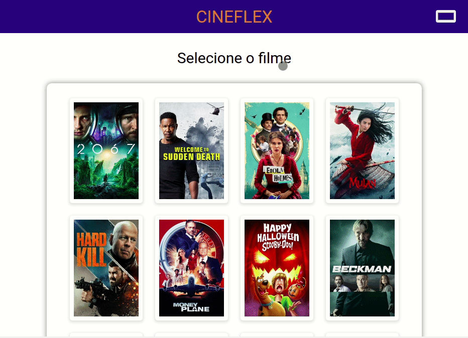

# Cineflex

Try it out now at https://cineflex-opal.vercel.app/ <br>

A simple website to buy movie tickets online.



## Technologies
The following tools and frameworks were used in the construction of the project:<br>
<p>
  
  
  
  
</p>

## How to run

1. Create a root project folder named cineflex
```
mkdir cineflex
```
2. Clone the front-end repo
```
git clone https://github.com/PMafra/cineflex.git
```
3. Install NPM packages for the front-end repo
```
npm install
```
8. Run the app with
```
npm start
```
9. You can optionally build the project running (See the section about [deployment](https://facebook.github.io/create-react-app/docs/deployment) for more information)
```
npm run build
```
10. Finally access http://localhost:3000 on your favorite browser (unless it is Internet Explorer. In this case, review your life decisions :eyes:)
